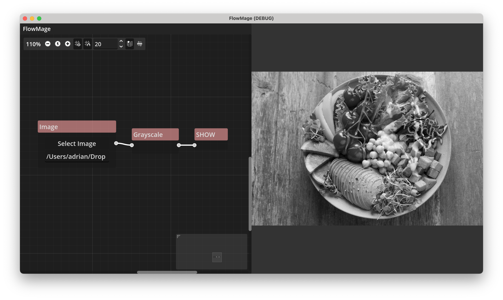

# FlowMage

The missing flow/graph based GUI for image editing.
Powered by [Godot] and [FlatCV].

[Godot]: https://godotengine.org
[FlatCV]: https://github.com/ad-si/FlatCV

## Roadmap

- [ ] Split `GraphEdit` and `Image` with draggable separator
- [ ] Add buttons to nodes
  - [ ] Switch to pass-through mode
  - [ ] Replace node
  - [ ] Information / Help
- [ ] Image from URL
- [ ] Integrate OpenCV (https://github.com/Keyaku/bouncy)

## Related

- [Adaptive Vision Studio] - Data-flow software for machine vision engineers
- [Cascade] - Node-based image editor with GPU-acceleration
- [chaiNNer] - Node-based image processing and AI upscaling GUI
- [Conjure] - Simple graphical desktop app for [ImageMagick].
- [Cresliant] - Node-based image editor made in Python.
- [Effector] - TODO.
- [FotoKilof] - Comprehensive desktop app for [ImageMagick].
- [GIE] - Generative Image Editor is a node based image editor
- [GimelStudio] - Cross-platform non-destructive, node based 2D image editor
- [ImagePlay] - Prototyping tool for building image processing algorithms
- [ImprovCV] - Portable, open source, modular computer vision system
- [Nimp] - Node-based image manipulation program (webapp)
- [nip2] - Spreadsheet-like GUI for [libvips].
- [PaperVision] - Node editor interface for OpenCV.
- [Pictonode] - Node-based image editor powered by [GEGL].
- [PixaFlux] - CG materials creator with a non-destructive, node-based workflow.
- [PixiEditor] - Universal 2D Graphics Editor

[Adaptive Vision Studio]: https://www.adaptive-vision.com/en/software/studio/
[Cascade]: https://github.com/ttddee/Cascade
[chaiNNer]: https://github.com/chaiNNer-org/chaiNNer
[Conjure]: https://github.com/nate-xyz/conjure
[Cresliant]: https://github.com/Cresliant/Cresliant
[Effector]: https://notabug.org/grindhold/effector
[FotoKilof]: https://github.com/TeaM-TL/FotoKilof
[GEGL]: https://gegl.org
[GIE]: https://github.com/alexge50/gie
[GimelStudio]: https://github.com/GimelStudio/GimelStudio
[ImagePlay]: https://cpvrlab.github.io/ImagePlay/
[ImprovCV]: http://www.adrianboeing.com/improvCV/index.html
[libvips]: https://github.com/libvips/libvips
[Nimp]: https://nimp.app/
[nip2]: https://github.com/libvips/nip2
[PaperVision]: https://github.com/deltacv/PaperVision
[Pictonode]: https://github.com/TeamPictonode/pictonode
[PixaFlux]: http://www.pixaflux.com/
[PixiEditor]: https://pixieditor.net/docs/usage/node-graph/getting-started-with-node-graph/
